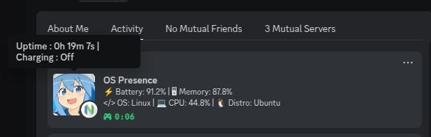

# Discord OS Presence




## 📌 About
**Discord OS Presence** is a lightweight presence tool that displays system information on your Discord profile, including:
- 🔋 Battery Percentage
- 💻 OS Name & Distro Name
- 🧠 Memory Usage
- 🚀 CPU Usage
- ⏳ System Uptime
- ⚡ Charging Status

## 🚀 Features
- Real-time system monitoring
- Seamless Discord Rich Presence integration
- Lightweight and efficient

## 📦 Installation
### Requirements
- Python 3.x
- `pypresence` library (for Discord Rich Presence)
- `psutil` library (for system monitoring)

### Steps
1. Clone the repository:
   ```sh
   git clone https://github.com/AnirbanNath-dev/discord-os-presence.git
   cd discord-os-presence

2.  Activate virtual environment
    ```sh
    python3 -m venv .venv
    source .venv/bin/activate

3. Install dependencies
    ```sh
    pip install -r requirements.txt

4. Generate service file
    ```sh
    chmod +x generate_service.sh
    ./generate_service.sh

5. Run start bash script
    ```sh
    chmod +x start.sh
    ./start.sh